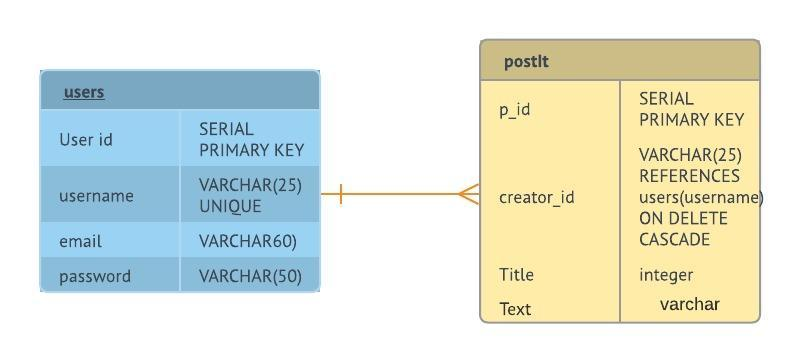
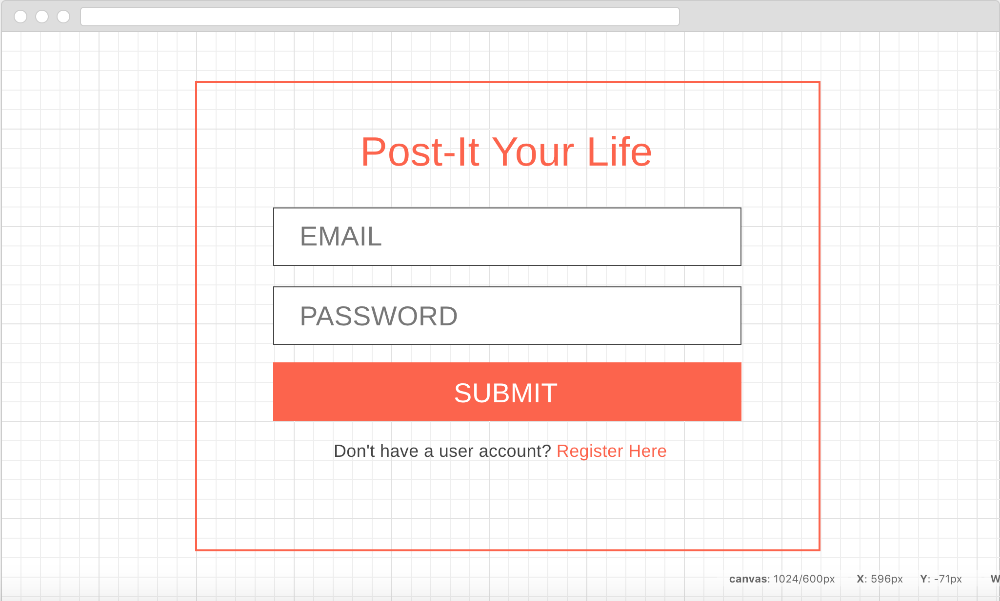
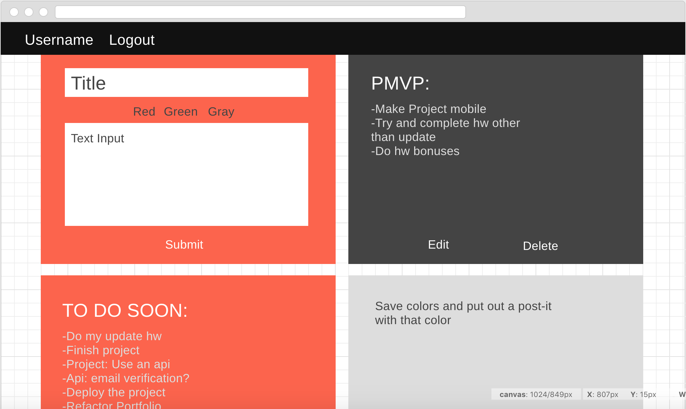
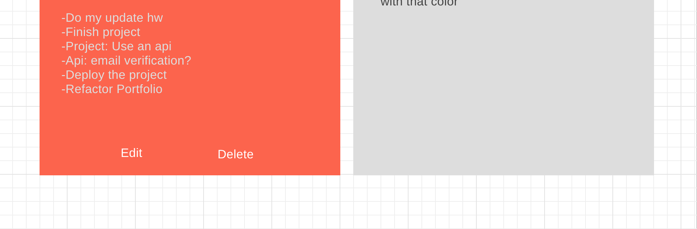

# Project Overview

## Project Schedule

This schedule will be used to keep track of your progress throughout the week and align with our expectations.  

You are **responsible** for scheduling time with your squad to seek approval for each deliverable by the end of the corresponding day, excluding `Saturday` and `Sunday`.

### Personal Final Project 

|  Day | Deliverable | 
|---|---|
|Project Week actually started Wednes |---|
|Day 1: Thu 5/24 | Wireframes, Priority Matrix, Schedule, Time Estimates |
|Day 2: Fri 5/25 | Approval\Pseudocode\Actual code\|
|Day 3: Sat 5/26 | Work on project  |
|Day 4: Sun 5/27 | Work on project  |
|Day 5: Mon 5/28 | Work on project  |
|Day 6: Tues 5/29 | Work on project  |
|Day 7: Wed 5/30 | Work on project  |
|Day 8: Thurs 5/31  | Work on project  |
|Day 9: Fri 6/1 | Working Prototype with full commit to master |
|Day 10: Sat 6/2 | Deployment |
|Day 11: Sun 6/3 | Final edits...branching first |
|Day 12: Mon 6/4 | Project Presentations |

## Project Description

A user can login and post things they have to do, delete or change the 
color of post it to green when they finish their task.

## Wireframes

## Priority Matrix

Include a link to your full the `Time\Priority` Matix. 

| Component | Priority | Estimated Time | Time Invetsted | Actual Time |
| --- | :---: |  :---: | :---: | :---: |
| Landing | H | 6hrs| 3hrs | hrs | 
| Register Page | H | 20hrs| 0hrs | 0hrs | 
| LogIn Page | H | 10hrs| 20hrs | hrs | 
| Show All Post-Its Page | H | 8hrs| 5hrs | hrs | 
| New One Post-It | H | 20hrs| 10hrs | hrs | 
| Edit One Post-It | H | 30hrs| 19hrs | hrs | 
| Delete One Post-It | H | 1hrs| 10hrs | hrs |
| Responsive Site | H | 5hrs| 1hrs | hrs |
| Style Css | H | 3hrs| 1hrs | hrs |
| Change Color of PostIt User Action | L | 20hrs| 0hrs | 0hrs |
| Email Verification API | L | 15hrs| 0hrs | 0hrs | 
| Emojis API | L | 30hrs| 0hrs | 0hrs | 

## MVP 

-Authorization
-Posting Post-Its
-deleting posts
-editing the posts

## POST MVP
-Allow user to change background-color for post-it
-Add emojis
-An email verification API

## Functional Components

Based on the initial logic defined in the previous game phases section try and breakdown the logic further into functional components, and by that we mean functions.  Does your logic indicate that code could be encapsulated for the purpose of reusablility.  Once a function has been defined it can then be incorporated into a class as a method. 

Time frames are also key in the development cycle.  You have limited time to code all phases of the game.  Your estimates can then be used to evalute game possibilities based on time needed and the actual time you have before game must be submitted. 

User function component
Post function component
Delete function component
Edit

| Component | Priority | Estimated Time | Time Invested | Actual Time |
| --- | :---: |  :---: | :---: | :---: |
| Landing | H | 20hrs| 0hrs | hrs |

## Helper Functions
Helper functions should be generic enought that they can be reused in other applications. Use this section to document all helper functions that fall into this category.

| Function | Description | 
| --- | :---: |  
| Capitalize | This will capitalize the first letter in a string | 

## Additional Libraries
 Use this section to list all supporting libraries and their role in the project. 

## Code Snippet

Use this section to include a brief code snippet of functionality that you are proud of an a brief description.  

## Change Log
 Use this section to document what changes were made and the reasoning behind those changes.  

## Issues and Resolutions
 Use this section to list of all major issues encountered and their resolution.
 **Error**: Auth wasn't able to access with premade email and password data:
 **RESOLUTION**: Needed to use rails db:seed
 **ERROR**: Rerouting issues from adding auth afterwards
